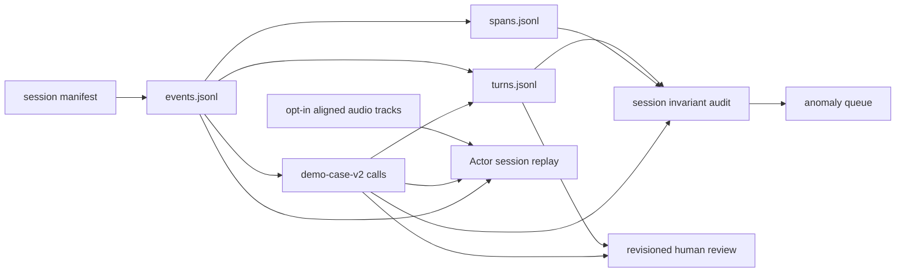

# Demo 诊断架构（demo-diagnostics-v1）

日期：2026-09-21。适用范围：Phase-A ActorEngine 浏览器 demo。本文是诊断链的架构与操作入口；产品行为、四态输入准入和语音连续性仍以 `docs/web_demo.md` 为准。

## 1. 设计目标与边界

诊断链把一次会话的配置、事件、模型调用、轮次结果、音频证据、自动审计和人工标注组织成同一个可查询单元。它解决的是可追溯、可重放、可标注和可删除，不参与模型决策。

长期约束：

- 诊断代码不授权状态转换，也不直接改 ActorEngine 状态；事件仍回到引擎队列，磁盘工作放在线程或会话关闭阶段。
- VAD、hold、continue 和打断等语义继续使用音频钟。服务端单调钟只用于调用/span 耗时，浏览器钟只用于偏移区间。
- 普通会话保存 trace 和模型调用案例；原始多轨音频必须由浏览器逐会话明确勾选，默认关闭。
- 所有诊断目录和文件分别使用 0700/0600；目录已被 Git 忽略。真实会话、录音和标注不得提交。
- 自动检查只判机械不变量。模型输出、路由语义、音色和内容质量不会自动成为 gold。
- 本版本不增加主观音色指标、ABX/MUSHRA 或未经校准的身份阈值。

## 2. 因果模型



稳定连接键如下：

| 层级 | 标识 | 用途 |
| --- | --- | --- |
| 会话 | `session_id` | manifest、trace、案例、review 和删除的根键 |
| 轮次 | `turn_id=g<generation>-t<turn>` | 人工审查和最终 outcome 的单位 |
| 操作 | `parent_id` | 连接输入、候选、回答、分句 TTS 与 utterance |
| 模型调用 | `call_id` | 连接 dispatch、容量、上游请求、case、首输出、终止 |
| 模型案例 | `case_id` | 指向冻结请求、处理后输入和模型输出 |
| 语音 | `utterance_id` | 连接文本、PCM、socket、ACK、取消和播放进度 |

`call_id` 使用无共享状态的 UUID 生成。工作协程可以创建它，但不会递增或修改引擎状态，符合单写者原则。

## 3. 私有存储布局

```text
exp/web-demo-<session>/realtimeout_live/
├── events.jsonl
└── diagnostics/
    ├── manifest.json
    ├── turns.jsonl
    ├── spans.jsonl
    ├── summary.json
    ├── reviews/<turn_id>/<revision>-<review_id>.json
    ├── replays/<run_id>/replay_report.json
    └── capture/                           # 仅明确 opt-in
        ├── browser_mic.wav
        ├── render_reference.wav
        ├── engine_clean.wav
        ├── frames.jsonl
        └── capture.json

exp/demo_cases/captures/<case_id>/
├── case.json
├── input-00.wav
└── output.wav
```

### 3.1 manifest

`demo-session-v1` 在握手后立即落盘，包含代码 revision 标识、协议版本和经过 allowlist 的有效配置。会话关闭前补入浏览器报告的音频设置和多轨采集结果。它不读取或保存密钥、完整环境变量、任意路径或完整 prompt。

### 3.2 事件与轮次索引

`demo-trace-v2` 为事件加入连续 `seq`。`turns.jsonl` 从 trace 和案例库派生，每轮汇总输入、路由、候选命运、回答/utterance、历史写入、播放样本、错误、`call_id` 和 `case_id`。派生文件可重建，原始事实仍以 trace/case 为准。

`response-completion-v1` 的 dispatch/completed/failed 也进入逐轮 outcome。原回答调用和最多一次续写调用共享 parent/utterance，case context 分别标为 `response_completion_stage=draft|repair`；续写失败另进入 warning 队列。记录不含词表命中位置或用户转写。

### 3.3 请求级 span

`demo-span-v1` 有两类主 span：

- model span：dispatch、容量取得及等待、首输出、完成、状态、错误、案例和可获得的上游 request ID；
- utterance span：回答开始、文本完成、首 PCM、末 PCM、首 socket 发送、播放 ACK、取消、TTS 解码/证明/等待细分。

所有 server milestone 都注明 `server_monotonic_ms`。ping/pong 只生成浏览器与服务端的时钟偏移估计及不确定区间；不把它解释为单向网络延迟或物理出声时刻。case 的 `outcome.elapsed_ms` 仍可能包含消费回压，分析纯推理耗时时应使用 span 里的阶段边界。

## 4. 会话关闭与自动审计

正常断线依次执行：

1. 保存有界多轨缓冲（若启用）；
2. 等待本会话已经入队的案例持久化；
3. 关闭 trace 并写 `trace_closed`；
4. 生成 turn、span 和 `summary.json`；
5. 由 review API/CLI 只读展示，人工标注另写修订文件。

`summary.json` 目前检查：

- trace 是否闭合、是否丢事件、序号是否连续；
- 模型 case 是否完成 started → queued → durable，call 是否有终止事件；
- total/normal 容量是否越界，会话结束时任务和容量是否排空；
- 相同 input revision 是否出现冲突路由，stale 输入是否又改变状态；
- stop/wait 后是否无授权启动回答；
- 私有候选是否在确认前公开；
- 取消后是否继续发送音频；播放样本是否回退或超过已发送/收到样本；
- 首 PCM 前是否已有逐字文本证明；
- 内部打断元数据是否进入 assistant history；
- 引擎、模型、语音错误以及 repair/fallback/timeout、underrun、socket slow send。

结果分为 `ok`、`warning` 和 `error`。warning/error 自动进入异常优先队列，但不代表语义一定错误。`session_reset` 会清除前一 generation 的 stop/wait 审计门，防止跨重置误报。

## 5. 两种重放，两个证据口径

### 5.1 单模型调用重放

`scripts/demo_cases.py replay` 继续复跑一个冻结模型请求，可选择原 prompt 或该调用类型的当前 prompt；response 案例也可直接做提示词改前改后对照。它适合验证解析器、模型输出或单句 TTS，不会自动触发引擎层的回答完成性续写，也不复现会话状态机。

### 5.2 Actor 会话 injected replay

`scripts/demo_diagnostics.py replay` 要求会话明确保存过未截断的多轨采集。它把以下事实注入当前 ActorEngine：

- 原始麦克风/播放参考帧及样本钟；
- 当时的浏览器控制事件和 VAD 边界；
- 已保存的真实模型输出和首输出等待；
- 当时保存的 ASR 输出。

重放不访问模型服务。`--speed 1` 保持录制帧和模型首输出的墙钟节奏；更高倍速只用于调试，报告中明确 `timing_comparable=false`。结果比较高层动作签名，而不要求随机 UUID 或墙钟数值相同。环形缓冲已经截断的会话不冒充完整端到端重放。

## 6. 多轨音频采集

服务端配置只表示允许采集。用户仍需在 demo 页面勾选“为下一次连接保存……”，握手才会发送 `diagnostic_capture=true`。三条 16 kHz 对齐轨道共享帧序号、样本偏移和音频钟：

1. `browser_mic.wav`：浏览器送出的麦克风轨；
2. `render_reference.wav`：同帧的播放参考；
3. `engine_clean.wav`：服务端证据处理后的输入。

`frames.jsonl` 记录每帧 seq、样本偏移、长度和轨道 presence；`capture.json` 记录浏览器 AEC/降噪/AGC 等实际设置。内存只保留最后 `diagnostic_audio_capture_seconds`，当前为 180 秒，超长会话设置 `truncated=true`。它用于定位短停止在采集、参考消除、VAD 或模型层的丢失，不用于增加停止词白名单或改变在线决策。

## 7. 逐轮 review

本机页面：`http://127.0.0.1:18000/demo/diagnostics.html`。

页面以轮次为单位显示 manifest、异常、路由、候选/outcome、关联模型调用、输入/输出音频和已有 review。标签支持：

`vad_or_truncation`、`transcription`、`route`、`third_party_or_echo`、`response_content`、`tts_fidelity`、`voice`、`stutter_or_underrun`、`cancellation`、`history_pollution`、`latency`、`cannot_determine`、`acceptable`。

每次保存都追加 `demo-turn-review-v1` 修订，记录 reviewer、时间、依据和 revision，不覆盖旧判断。页面和 API 只在 `diagnostics_review=true` 时开放；当前部署只监听回环，不能把它当作公网鉴权边界。

## 8. 配额、抽样、保留与删除

当前策略：

- 总案例上限 2000 个/512 MiB；单请求估计上限 4 MiB，输出前缀上限 2 MiB；
- 按 kind 分区：TTS 45%、input_route 28%、response 15%、shift 6%、input_reply 4%、shift_s 2%；一个 kind 满额不会关闭其他分区；
- `case_capture_success_sample_rate` 是普通 completed 调用的抽样开关；错误和取消始终保留。当前为 1.0，等已有审查基线后再降低；
- 会话和案例保留期当前为 30 天；服务启动时清理过期会话及其关联 case，案例 writer 也清理孤立过期 case；
- 删除会话时同时删除 manifest、trace、turn/span、capture、review、replay report 和按 `session_id` 关联的所有 case。

配额和抽样的 drop reason 可在 `/api/demo/info` 中检查。写入失败、队列满和配额满均 fail-open，不改变会话行为。硬杀进程仍可能丢在飞记录。

## 9. 操作入口

```bash
# 异常优先队列 / 全部会话 / 单会话因果包
python scripts/demo_diagnostics.py list --anomalies
python scripts/demo_diagnostics.py list
python scripts/demo_diagnostics.py show SESSION_ID

# 从现有 trace/case 重建 turn、span 和 invariant summary
python scripts/demo_diagnostics.py audit SESSION_ID

# 追加逐轮 review 修订
python scripts/demo_diagnostics.py review SESSION_ID TURN_ID \
  --label route --label latency --reviewer NAME --note '人工核验说明'

# 当前 ActorEngine 无模型会话重放
python scripts/demo_diagnostics.py replay SESSION_ID --speed 1

# 明确执行保留策略，或完整删除一场会话的关联资产
python scripts/demo_diagnostics.py prune --days 30
python scripts/demo_diagnostics.py delete SESSION_ID
```

本地 API：

- `GET /api/demo/diagnostics/sessions?anomalies_only=true`
- `GET /api/demo/diagnostics/sessions/{session_id}`
- `POST /api/demo/diagnostics/sessions/{session_id}/turns/{turn_id}/reviews`
- `GET /api/demo/diagnostics/cases/{case_id}/audio/{name}`
- `DELETE /api/demo/diagnostics/sessions/{session_id}`

删除命令/API 是立即执行的本地操作。需要长期保留的已授权研究样本，应先按项目的数据治理流程另行归档，不能通过提交仓库保存。

## 10. 配置与回退

`configs/demo_chat.yaml` 的诊断项：

- `case_capture*`：真实模型调用案例、总配额、kind 分区和成功抽样；
- `diagnostics_review`：review 页面/API；
- `diagnostics_retention_days`：会话与案例保留期；
- `diagnostic_audio_capture_allowed`：允许客户端逐会话 opt-in；
- `diagnostic_audio_capture_seconds`：多轨环形上限。

关闭 review 或多轨权限不会删除历史资产；使用 CLI 明确 prune/delete。关闭这些诊断开关不会改变 guarded-turns、候选确认、hold/continue、VAD 或 TTS 行为。

## 11. 已知限制

- 诊断页面是回环部署的运维界面，没有多租户权限模型。
- 自动审计能发现事件所证明的机械矛盾，不能证明未记录事件之外的事实。
- 浏览器 ACK 是应用层事实，不是物理扬声器实际出声测量。
- 会话 replay 依赖未截断多轨、完整案例和当前代码兼容性；它不保证随机波形逐字节一致。
- 旧 `demo-trace-v1` / `demo-case-v1` 仍可用于历史审计，但没有完整统一 ID 时只能降级关联，不能伪造成 v2 因果包。
